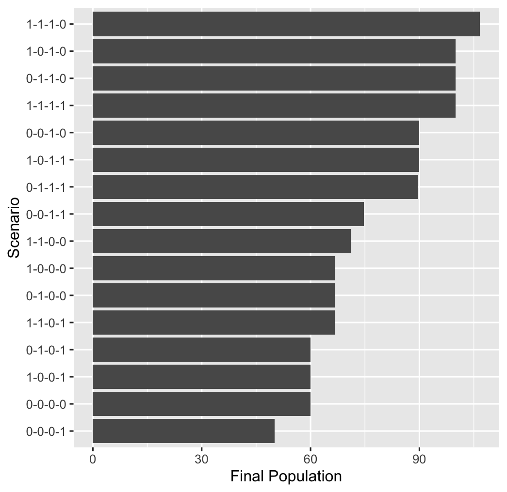

# Strategy Analysis

This set of exercises from [SD4DS](https://github.com/CBSDLab/SD4DS) provides an introduction to designing and running a strategy analysis where one is interested in testing combinations of policies. Since the number of combinations potential strategies grows exponentially with the number of policies being considered, the computation time grows exponentially, which makes running a strategy analysis on the High Performance Computing (HPC) cluster appealing.

The approach to conducting a strategy analysis builds on the approach from the [SD4DS-policy-analysis](https://github.com/CBSDLab/SD4DS-policy-analysis) using the "limits to growth v2.stmx" file with the policy switches added to the model.

## Overview

Setting up a strategy analysis begins with creating a study file that can be used to run a series of strategy scenarios involving combinations of policies. While the number policies and strategies based on these policies may be relatively small in reality, a major potential benefit of building a simulation model is being able to fully explore all the scenarios and leverage computational resources to do so.

Three exercises are offered:

1.  **Setting up the stratgy file**. We need to set up the study design file for the study. What we will quickly discover is that we run out of computational resources.
2.  **Diagnosing and fixing the out of memory error.** We work through this and find ways to fix this and along the way, discover some important issues we need to consider in optimizing our code and simulation studies.
3.  **Analyzing and plotting results.** The results generate a lot of data that we need to analyze and communicate. Some basic ideas are offered, but a lot of unexplored opportunities exist for creative data visualizations and explorations of high dimensional data sets.

## 1. Setting up the strategy study file

To test different combinations of strategies, we first need to identify the variables we want to modify. The following R code creates a list of names that we can use to generate a data frame for our simulation study.

```         
# Load and view the template
library(readr)
Template <- read_csv("Template.csv")

# Create the strategy_study1_df
strategy_study1_df <- Template

# Find the variable names with switches for turning policies on
# and off where 1=on and 0=off. 
SW_vec <- grep("SW", names(Template))
names(Template[SW_vec])
```

Once we have identified the variables we want to change in our strategy study, we create a list of lists that we can use to generate all combinations. This can be automated, but initially it is better to write this out explicitly so that one is clear on which policies are being turned on and off.

```         
SW_list <- list(
  "IP1 Crude Birth Rate.SW" = c(0,1),
  "IP2 Mortality Rate.SW"= c(0,1),
  "IP3 Carrying Capacity.SW" = c(0,1),
  "IP4 Effect of Population Size on Births.SW" = c(0,1)
)
```

This list can be used to generate all combinations of policy switches and saved to a file.

```         
strategy_study1_df<-expand.grid(SW_list)
write_csv(strategy_study1_df,"strategy_study1.csv")
```

Lastly, one will need to set up the shell script that we'll submit to SLURM as a batch job. The template is `simulate_study_template.sh` and the first version is `simulate_strategy_study.sh`. Note that you'll need to modify the latter with your email address.

Excute this with the following command to see what happens.

```         
simulate_strategy_study1.sh 
```

Running this, you'll likely get a cryptic email with an "OUT_OF_MEMORY" error signaling that the job did not complete successfully and this was because you ran out of memory.

One option is to increase the amount of memory requested. While this might solve the immediate problem, it's not a good approach without some diagnosis of what is causing the out of memory error.

## 2. Diagnosing and fixing OUT_OF_MEMORY error

When your job does not complete, there will be an output file of what happened that can provide some useful clues. Specifically, from this example, you should see a file with with a "serial-R.out" prefix. Opening this up should be similar to Figure 2.

**Figure 2.** Output from serial-R.out file

```         
/home/psh39/Stella_Simulator/stella_simulator -q 'limits to growth v2.stmx'
Stella Simulator version 3.5.1 (3169), Copyright (C) 2023 by isee systems, inc.
Registered to: Peter S Hovmand, Case Western Reserve University
Stella Simulator version 3.5.1 (3169), Copyright (C) 2023 by isee systems, inc.
Registered to: Peter S Hovmand, Case Western Reserve University
Stella Simulator version 3.5.1 (3169), Copyright (C) 2023 by isee systems, inc.
Registered to: Peter S Hovmand, Case Western Reserve University
Stella Simulator version 3.5.1 (3169), Copyright (C) 2023 by isee systems, inc.
Registered to: Peter S Hovmand, Case Western Reserve University
Stella Simulator version 3.5.1 (3169), Copyright (C) 2023 by isee systems, inc.
Registered to: Peter S Hovmand, Case Western Reserve University
Stella Simulator version 3.5.1 (3169), Copyright (C) 2023 by isee systems, inc.
Registered to: Peter S Hovmand, Case Western Reserve University
Stella Simulator version 3.5.1 (3169), Copyright (C) 2023 by isee systems, inc.
Registered to: Peter S Hovmand, Case Western Reserve University
Stella Simulator version 3.5.1 (3169), Copyright (C) 2023 by isee systems, inc.
Registered to: Peter S Hovmand, Case Western Reserve University
Stella Simulator version 3.5.1 (3169), Copyright (C) 2023 by isee systems, inc.
Registered to: Peter S Hovmand, Case Western Reserve University
Stella Simulator version 3.5.1 (3169), Copyright (C) 2023 by isee systems, inc.
Registered to: Peter S Hovmand, Case Western Reserve University
Stella Simulator version 3.5.1 (3169), Copyright (C) 2023 by isee systems, inc.
Registered to: Peter S Hovmand, Case Western Reserve University
Stella Simulator version 3.5.1 (3169), Copyright (C) 2023 by isee systems, inc.
Registered to: Peter S Hovmand, Case Western Reserve University
Stella Simulator version 3.5.1 (3169), Copyright (C) 2023 by isee systems, inc.
Registered to: Peter S Hovmand, Case Western Reserve University
Stella Simulator version 3.5.1 (3169), Copyright (C) 2023 by isee systems, inc.
Registered to: Peter S Hovmand, Case Western Reserve University
Stella Simulator version 3.5.1 (3169), Copyright (C) 2023 by isee systems, inc.
Registered to: Peter S Hovmand, Case Western Reserve University
Stella Simulator version 3.5.1 (3169), Copyright (C) 2023 by isee systems, inc.
Registered to: Peter S Hovmand, Case Western Reserve University
/var/spool/slurm/job2957674/slurm_script: line 17: 1939373 Killed                  Rscript process_results.R
cp: cannot stat 'study_results.csv': No such file or directory
[2025-11-02T19:04:29.985] error: Detected 1 oom_kill event in StepId=2957674.batch. Some of the step tasks have been OOM Killed.
```

Working out what all of this means can be a challenge. In this case, it's relatively easy to count all the times Stella Simulator was called and figure out that Stella Simulator was called 16 times, which is the same as the number of scenarios we requested in our study file. However, one can imagine that for thousands of simulations, this will not work and one might want to add code to our scripts somewhere to make this easier to interpret. For now, we will ignore that.

What stands out is that the R script process_results.R *was called* and then killed because of an out of memory (OOM) event. That tells us that the problem is in the R script used to process the results.

The R script we used loaded in the results from each run and appended them to a data frame in working memory, and then saved the results to a .csv file. This is a limitation of R in that the size of data frames are limited to the amount of available working memory. For the default memory allocation to a compute node, this is 1 GB, which is very small when compared to the average laptop today.

Even though this is a tiny system dynamics model with only four policy switches, it may be a bit surprising that one runs into this kind of constraint so quickly. Again, the temptation might be to simply increasing the memory requested on the HPC to fix the problem, but this doesn't help one figure out how to diagnosed nd optimize code, which is *essential* for taking advantage of HPCs. Moreover, learning how to manage larger data sets efficiently is critical to understanding how to write good and efficient code in data science.

Each results file is \~16 MB and with 16 scenarios and this would amount to \~256 MB, which is well within the default memory limits of the CWRU HPC of 1 GB, we are still running short of working memory. However, working memory is consumed by the programs and packages we're running plus other overhead. This may be a bit suprising given the small model and estimation and one might have expected this to be well within the range of available working memory.

How do we mimize the demand on working memory in R when merging multiple files? THere are many ways of doing this, but the most obvious is not trying to maintain the data as a data frame in working memory. Specifically, instead of appending to a data frame in working memory, we append to a .csv file.

The following R code does that and reads in each result and appends it to a .csv file. The load on working memory is constant and proportional to the size of reach result.

```         
for (i in 1:length(results_list)) {
  tmp<-read_csv(file=results_list[i], show_col_types = FALSE)
  tmp_df <- data.frame(Run = i,
                       tmp)
  if (i==1) {
    write_csv(tmp_df, file = "study_results.csv")
  } else {
    write_csv(tmp_df, file = "study_results.csv", append = TRUE)
  }
}
```

The revised file "simulate_strategy_study1_v2.sh" should excute successfully.

## 3. Analyzing and plotting results

Once we have the results file from our strategy study, we'll want to download and analyze the results. This is generally better done locally on a laptop or desktop as most laptops/desktops can process data of this size and it's highly interactive with refining code, choosing among many options for vizualization, and highly customized.

Start by downloading the .csv file from the strategy analysis to your local computer. Although this example uses R to illustrate some basic analyses, one could use any of popular programming language or software application for visualizing and analyzing results including Excel, Python, Tableau, SPSS, SAS, STATA, etc.

The first step is usually to get a sense of the best strategies on the outcome variable of interest. The following R code loads the libraries needed, imports the results, creates a name for each scenario based on the switch values, and arranges the results by descending order of the highest population at the end of the simulation with a list of the best 10 best strategies. Note that in this simple model, there are a total of 16 strategies, so the top 10 of 16 might not be all that interesting. However, it does take a lot of policy switches to get beyond this in scope (add one more and we are at 32 combinations, one more and 64 combinations, yet another, at 128 combinations, etc.) and the top 10 is a reasonable starting place.

We start by importing the results and creating a vector for the scenarios that we we can use as a label.

```         
# import results
library(readr)
library(tidyverse)
results <- read_csv("strategy_study1_results.csv")

# get the policy switch variables
vars <- names(results)
SW_vec <- grep("SW", vars)

# check time horizon
range(results$Years)
ftable(results[results$Years==100,SW_vec])

# create a vector to summarize the policy switches that are on
scenario <- apply(results[,vars[SW_vec]],1, paste0, collapse="-")
```

Next, we create a temporary data frame sorted by our desired outcome.

```         
# select the final population for comparisons against policy 
# scenarios
results %>%
  mutate(Scenario = scenario) %>%
  filter(Years == 100) %>%
  mutate(`Final Population` = Population) %>%
  select(Scenario, `Final Population`) -> tmp
```

To look at the top ten senarios, we arrange the final values in decsendin order and print the top 10.

```         
# sort the results from highest to lowest and show
# the top 10 scenarios
tmp %>%
  arrange(desc(`Final Population`)) %>% head(10) 
```

It is often helpful to visualize the results in order of the desired impact of a strategy. This is useful for identifying patterns and cut-points in strategies to narrow the analysis.

```         
tmp %>%
  arrange(`Final Population`) %>%
  mutate(Scenario=factor(Scenario, levels = Scenario)) %>%
  ggplot() + 
    geom_col(aes(x=`Final Population`,y=Scenario))
```

Doing this gives us the plot in Figure 1 where we see a jump in the outcome from strategy 0-0-1-1 to 0-1-1-1, which would suggest we might want to focus our subsequent analysis on the strategies with outcomes equal to or better than 0-1-1-1.

**Figure 1.** Strategies sorted by Final Population



## On your own

This set of exericses only considered running analyses of different combinations of strategies as if they were stacked, which carries the implication of not being constrained in resources. How would you modify the analysis to reflect constrained reosurces?
